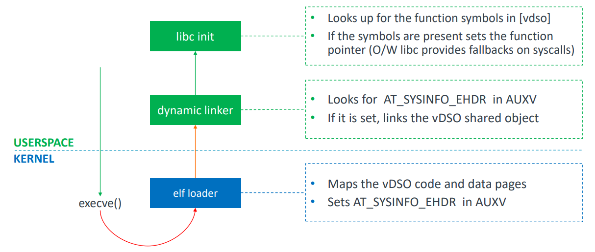

## record

- 了解 vDSO 概念，以及 [riscv](https://tinylab.org/riscv-syscall-part4-vdso-implementation/) 和 [aarch64](https://docs.google.com/document/d/1Yg3L_StCQxPLJf3gDWJ9UQqIeCYgjqbThLSkQImP-JA/edit?tab=t.0) 的实现。

**TODO**: 

- 实现最小的 vdso, 使程序能够调用 vdso 中的函数（使用 Linux vdso.so）

### impl

将 vdso.so 嵌入到内核中, 并且能够访问到 vdso.so

[riscv-vdso.so](https://github.com/asterinas/linux_vdso)

```rust
diff --git a/src/main.rs b/src/main.rs
index 96bdbbc..5b6c117 100644
--- a/src/main.rs
+++ b/src/main.rs
@@ -7,6 +7,21 @@ extern crate axlog;
 extern crate alloc;
 extern crate axruntime;

+use core::arch::global_asm;
+global_asm!(
+    "
+       .globl vdso_start, vdso_end
+       .section .data
+    .balign 4096
+vdso_start:
+       .incbin \"apps/vdso/riscv64/vdso.so\"
+       .balign 4096
+vdso_end:
+
+       .previous
+    "
+);
+
 mod entry;
 mod mm;
 mod syscall;
@@ -33,4 +48,21 @@ fn main() {
         let exit_code = entry::run_user_app(&args, &[]);
         info!("User task {:?} exited with code: {:?}", args, exit_code);
     }
+
+    unsafe extern "C" {
+        static vdso_start: usize;
+        static vdso_end: usize;
+        fn _sdata();
+        fn _edata();
+    }
+    unsafe {
+        let start = &vdso_start as *const usize;
+        let end = &vdso_end as *const usize;
+
+        info!(
+            "sdata : {:#x}, edata: {:#x}",
+            _sdata as usize, _edata as usize
+        );
+        info!("vdso_start : {:p}, vdso_end : {:p}", start, end);
+    }
 }
```

**output**

```txt
[  0.364155 0:2 starry:62] sdata : 0xffffffc080274000, edata: 0xffffffc080279000
[  0.365065 0:2 starry:66] vdso_start : 0xffffffc080275000, vdso_end : 0xffffffc080277000
[  0.366117 0:2 axhal::platform::riscv64_qemu_virt::misc:3] Shutting down...
```

## vDSO

### vdso image

riscv


### vdso setup(userspace)



在内核中需要设置好 `aux_vector` 并且将 vvar 和 vdso text 映射到用户地址空间即可。

需要动态链接器的程序，会在动态链接其中初始化 vdso

静态编译的程序，会在初始化 libc 时初始化 vdso

## ref

- https://docs.google.com/document/d/1Yg3L_StCQxPLJf3gDWJ9UQqIeCYgjqbThLSkQImP-JA/edit?tab=t.0

- https://www.man7.org/linux/man-pages/man7/vdso.7.html

- https://0xax.gitbook.io/linux-insides/summary/syscall/linux-syscall-3?utm_source=chatgpt.com#introduction-to-vdso

- https://lpc.events/event/7/contributions/664/attachments/509/918/Unified_vDSO_LPC_2020.pdf?utm_source=chatgpt.com

- https://zhuanlan.zhihu.com/p/1916899195517908765?share_code=1L5qZ1GJmVYu&utm_psn=1927750544090457298

- https://tinylab.org/riscv-syscall-part4-vdso-implementation/
