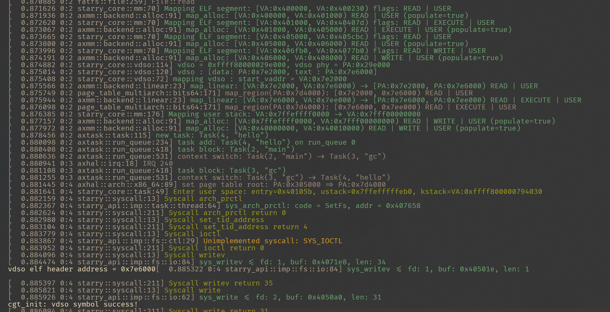

# 2025-7-16

## record

- 跑通 vDSO 模块流程，libc 能够识别并使用 vdso.so 中的符号

存在问题：
- 实际调用的是 vDSO 中的 fallback，猜测 vdso_data 不够完善导致错误从而调用fallback

### 测试程序：

```c
#include <dlfcn.h>
#include <elf.h>
#include <stdio.h>
#include <sys/auxv.h>
#include <time.h>

int main() {
  unsigned long addr = getauxval(AT_SYSINFO_EHDR);
  printf("vdso elf header address = %#lx\n", addr);

  struct timespec ts;
  clock_gettime(CLOCK_MONOTONIC, &ts);
}
```

修改了 musl-libc 来调试程序：
- 在 `cgt_init` 中添加debug信息，检查是否找到 vDSO 的符号
```c
// src/time/clock_gettime.c
static int cgt_init(clockid_t clk, struct timespec *ts) {
  void *p = __vdsosym(VDSO_CGT_VER, VDSO_CGT_SYM);
#ifdef VDSO_CGT32_SYM
  if (!p) {
    void *q = __vdsosym(VDSO_CGT32_VER, VDSO_CGT32_SYM);
    if (q) {
      a_cas_p(&vdso_func_32, 0, q);
      p = cgt_time32_wrap;
    }
  }
#endif
  if (!p) {
    // 直接写到标准错误
    const char *msg = "cgt_init: vdso symbol not found\n";
    write(2, msg, strlen(msg));
  } else {
    const char *msg = "cgt_init: vdso symbol success!\n";
    write(2, msg, strlen(msg));
  }
  int (*f)(clockid_t, struct timespec *) =
      (int (*)(clockid_t, struct timespec *))p;
  a_cas_p(&vdso_func, (void *)cgt_init, p);
  return f ? f(clk, ts) : -ENOSYS;
}

static void *volatile vdso_func = (void *)cgt_init;

#endif

int __clock_gettime(clockid_t clk, struct timespec *ts) {
  int r;

#ifdef VDSO_CGT_SYM
  int (*f)(clockid_t, struct timespec *) =
      (int (*)(clockid_t, struct timespec *))vdso_func;
  if (f) {
    r = f(clk, ts);
    if (!r)
      return r;
    if (r == -EINVAL)
      return __syscall_ret(r);
    /* Fall through on errors other than EINVAL. Some buggy
     * vdso implementations return ENOSYS for clocks they
     * can't handle, rather than making the syscall. This
     * also handles the case where cgt_init fails to find
     * a vdso function to use. */
  }
#endif

#ifdef SYS_clock_gettime64
  r = -ENOSYS;
  if (sizeof(time_t) > 4)
    r = __syscall(SYS_clock_gettime64, clk, ts);
  if (SYS_clock_gettime == SYS_clock_gettime64 || r != -ENOSYS)
    return __syscall_ret(r);
  long ts32[2];
  r = __syscall(SYS_clock_gettime, clk, ts32);
  if (r == -ENOSYS && clk == CLOCK_REALTIME) {
    r = __syscall(SYS_gettimeofday, ts32, 0);
    ts32[1] *= 1000;
  }
  if (!r) {
    ts->tv_sec = ts32[0];
    ts->tv_nsec = ts32[1];
    return r;
  }
  return __syscall_ret(r);
#else
  r = __syscall(SYS_clock_gettime, clk, ts);
  if (r == -ENOSYS) {
    if (clk == CLOCK_REALTIME) {
      __syscall(SYS_gettimeofday, ts, 0);
      ts->tv_nsec = (int)ts->tv_nsec * 1000;
      return 0;
    }
    r = -EINVAL;
  }
  return __syscall_ret(r);
#endif
}
```
### 运行结果

AUX 向量正确输出，`cgt_init` 成功找到 `__vdso_clock_gettime`, 如下所示：




### 代码改动：

```
diff --git a/Cargo.lock b/Cargo.lock
index a6b99aa..66c6b2e 100644
--- a/Cargo.lock
+++ b/Cargo.lock
@@ -1232,6 +1232,7 @@ checksum = "a8f112729512f8e442d81f95a8a7ddf2b7c6b8a1a6f509a95864142b30cab2d3"
 name = "starry"
 version = "0.1.0"
 dependencies = [
+ "axalloc",
  "axerrno",
  "axfeat",
  "axfs",
@@ -1285,6 +1286,7 @@ dependencies = [
 name = "starry-core"
 version = "0.1.0"
 dependencies = [
+ "axalloc",
  "axconfig",
  "axerrno",
  "axfs",
diff --git a/Cargo.toml b/Cargo.toml
index 9d11edb..57cff36 100644
--- a/Cargo.toml
+++ b/Cargo.toml
@@ -34,6 +34,7 @@ axns = { git = "https://github.com/oscomp/arceos.git", features = [
 axruntime = { git = "https://github.com/oscomp/arceos.git" }
 axsync = { git = "https://github.com/oscomp/arceos.git" }
 axtask = { git = "https://github.com/oscomp/arceos.git" }
+axalloc = { git = "https://github.com/oscomp/arceos.git" }
 
 axprocess = { git = "https://github.com/Starry-OS/axprocess.git" }
 axsignal = { git = "https://github.com/Starry-OS/axsignal.git", rev = "b5b6089" }
@@ -75,6 +76,7 @@ axlog.workspace = true
 axruntime.workspace = true
 axsync.workspace = true
 axtask.workspace = true
+axalloc.workspace = true
 
 axprocess.workspace = true
 axsignal.workspace = true
diff --git a/core/Cargo.toml b/core/Cargo.toml
index 9cf20b2..ab51d3c 100644
--- a/core/Cargo.toml
+++ b/core/Cargo.toml
@@ -15,6 +15,7 @@ axmm.workspace = true
 axns.workspace = true
 axsync.workspace = true
 axtask.workspace = true
+axalloc.workspace = true
 
 axprocess.workspace = true
 axsignal.workspace = true
diff --git a/core/src/lib.rs b/core/src/lib.rs
index bab7827..126a265 100644
--- a/core/src/lib.rs
+++ b/core/src/lib.rs
@@ -12,3 +12,6 @@ pub mod futex;
 pub mod mm;
 pub mod task;
 mod time;
+
+pub mod vdso;
+pub use vdso::*;
diff --git a/core/src/mm.rs b/core/src/mm.rs
index a99cc40..9c5ed8e 100644
--- a/core/src/mm.rs
+++ b/core/src/mm.rs
@@ -9,10 +9,12 @@ use axhal::{
     paging::{MappingFlags, PageSize},
 };
 use axmm::{AddrSpace, kernel_aspace};
-use kernel_elf_parser::{AuxvEntry, ELFParser, app_stack_region};
+use kernel_elf_parser::{app_stack_region, AuxvEntry, AuxvType, ELFParser};
 use memory_addr::{MemoryAddr, PAGE_SIZE_4K, VirtAddr};
 use xmas_elf::{ElfFile, program::SegmentData};
 
+use crate::mapping_vdso_uspace;
+
 /// Creates a new empty user address space.
 pub fn new_user_aspace_empty() -> AxResult<AddrSpace> {
     AddrSpace::new_empty(
@@ -54,7 +56,7 @@ pub fn map_trampoline(aspace: &mut AddrSpace) -> AxResult {
 ///
 /// # Returns
 /// - The entry point of the user app.
-fn map_elf(uspace: &mut AddrSpace, elf: &ElfFile) -> AxResult<(VirtAddr, [AuxvEntry; 16])> {
+fn map_elf(uspace: &mut AddrSpace, elf: &ElfFile) -> AxResult<(VirtAddr, [AuxvEntry; 17])> {
     let uspace_base = uspace.base().as_usize();
     let elf_parser = ELFParser::new(
         elf,
@@ -91,10 +93,12 @@ fn map_elf(uspace: &mut AddrSpace, elf: &ElfFile) -> AxResult<(VirtAddr, [AuxvEn
         // TDOO: flush the I-cache
     }
 
-    Ok((
-        elf_parser.entry().into(),
-        elf_parser.auxv_vector(PAGE_SIZE_4K),
-    ))
+    let vdso_elf_addr = mapping_vdso_uspace(uspace)?;
+    let mut auxv_vector: [AuxvEntry; 17] = [AuxvEntry::new(AuxvType::NULL, 0); 17];
+    auxv_vector[..16].copy_from_slice(&elf_parser.auxv_vector(PAGE_SIZE_4K));
+    auxv_vector[16] = AuxvEntry::new(AuxvType::SYSINFO_EHDR, vdso_elf_addr);
+
+    Ok((elf_parser.entry().into(), auxv_vector))
 }
 
 /// Load the user app to the user address space.
diff --git a/scripts/config.toml.temp b/scripts/config.toml.temp
index 5676d05..9c46778 100644
--- a/scripts/config.toml.temp
+++ b/scripts/config.toml.temp
@@ -11,3 +11,4 @@ axns = { path = "%AX_ROOT%/modules/axns" }
 axruntime = { path = "%AX_ROOT%/modules/axruntime" }
 axsync = { path = "%AX_ROOT%/modules/axsync" }
 axtask = { path = "%AX_ROOT%/modules/axtask" }
+axalloc = { path = "%AX_ROOT%/modules/axalloc" }
```