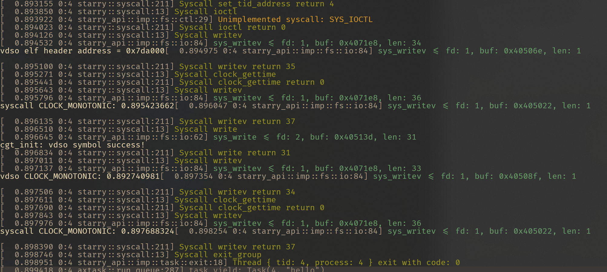

# 2025-7-21

## 记录

做了简单尝试，已经能够不进入内核中

- 尝试通过时钟中断来更新 vdso data.

### 待解决的问题

- arceos 不支持多个 trap handler

- 会因为中断间隔大，导致时间误差大。

- 锁(seqlock)

- 为 vdso data 中更多属性赋值

### 运行结果

测试代码

```c
#include <stdio.h>
#include <sys/auxv.h>
#include <time.h>

void test_sys() {
  struct timespec ts;
  int ret;
  int clk_id = CLOCK_REALTIME; // 0

  asm volatile("movq $228, %%rax\n\t"   // SYS_clock_gettime
               "movq %[clk], %%rdi\n\t" // clock ID
               "movq %[tsp], %%rsi\n\t" // pointer to timespec
               "syscall\n\t"
               "movl %%eax, %[ret]\n\t" // store return value
               : [ret] "=r"(ret)
               : [clk] "r"((long)clk_id), [tsp] "r"(&ts)
               : "rax", "rdi", "rsi", "rcx", "r11", "memory");

  if (ret == 0) {
    printf("syscall CLOCK_MONOTONIC: %ld.%09ld\n", ts.tv_sec, ts.tv_nsec);
  } else {
    printf("syscall clock_gettime failed, res = %d\n", ret);
  }
}

int main() {
  unsigned long addr = getauxval(AT_SYSINFO_EHDR);
  printf("vdso elf header address = %#lx\n", addr);

  test_sys();
  struct timespec ts;
  int res = clock_gettime(CLOCK_MONOTONIC, &ts);

  if (res == 0) {
    printf("vdso CLOCK_MONOTONIC: %ld.%09ld\n", ts.tv_sec, ts.tv_nsec);
  } else {
    printf("vdso clock_gettime failed, res = %d\n", res);
  }
  test_sys();
}
```



### 修改的代码

#### starry

```txt
diff --git a/Cargo.lock b/Cargo.lock
index 66c6b2e..6a97cdc 100644
--- a/Cargo.lock
+++ b/Cargo.lock
@@ -1301,6 +1301,7 @@ dependencies = [
  "crate_interface",
  "kernel-elf-parser",
  "linkme",
+ "linux-raw-sys",
  "memory_addr",
  "numeric-enum-macro",
  "percpu",
diff --git a/apps/myapp/hello.c b/apps/myapp/hello.c
index f21400b..08975dc 100644
--- a/apps/myapp/hello.c
+++ b/apps/myapp/hello.c
@@ -1,17 +1,40 @@
-#include <dlfcn.h>
-#include <elf.h>
 #include <stdio.h>
 #include <sys/auxv.h>
 #include <time.h>
-// #define N 1000000
 
+void test_sys() {
+  struct timespec ts;
+  int ret;
+  int clk_id = CLOCK_REALTIME; // 0
+
+  asm volatile("movq $228, %%rax\n\t"   // SYS_clock_gettime
+               "movq %[clk], %%rdi\n\t" // clock ID
+               "movq %[tsp], %%rsi\n\t" // pointer to timespec
+               "syscall\n\t"
+               "movl %%eax, %[ret]\n\t" // store return value
+               : [ret] "=r"(ret)
+               : [clk] "r"((long)clk_id), [tsp] "r"(&ts)
+               : "rax", "rdi", "rsi", "rcx", "r11", "memory");
+
+  if (ret == 0) {
+    printf("syscall CLOCK_MONOTONIC: %ld.%09ld\n", ts.tv_sec, ts.tv_nsec);
+  } else {
+    printf("syscall clock_gettime failed, res = %d\n", ret);
+  }
+}
 
 int main() {
   unsigned long addr = getauxval(AT_SYSINFO_EHDR);
   printf("vdso elf header address = %#lx\n", addr);
 
+  test_sys();
   struct timespec ts;
-  // for (int i = 0; i < N; i++) {
   int res = clock_gettime(CLOCK_MONOTONIC, &ts);
-  // }
+
+  if (res == 0) {
+    printf("vdso CLOCK_MONOTONIC: %ld.%09ld\n", ts.tv_sec, ts.tv_nsec);
+  } else {
+    printf("vdso clock_gettime failed, res = %d\n", res);
+  }
+  test_sys();
 }
diff --git a/core/Cargo.toml b/core/Cargo.toml
index ab51d3c..0b41d32 100644
--- a/core/Cargo.toml
+++ b/core/Cargo.toml
@@ -31,4 +31,6 @@ numeric-enum-macro = "0.2"
 percpu = "0.2.0"
 xmas-elf = "0.9"
 
+linux-raw-sys.workspace = true
+
 weak-map = { git = "https://github.com/Starry-OS/weak-map.git" }
diff --git a/core/src/vdso.rs b/core/src/vdso.rs
index 561e6a6..95b4942 100644
--- a/core/src/vdso.rs
+++ b/core/src/vdso.rs
@@ -1,13 +1,14 @@
 use core::{alloc::GlobalAlloc, arch::global_asm, slice};
 
+use alloc::boxed::Box;
 use axalloc::GlobalPage;
 use axerrno::{AxError, AxResult};
 use axhal::{
-    mem::{phys_to_virt, virt_to_phys},
-    paging::{MappingFlags, PageSize},
+    trap::{IRQ, register_trap_handler}, mem::{phys_to_virt, virt_to_phys}, paging::{MappingFlags, PageSize}, time::{current_ticks, monotonic_time, wall_time, TimeValue, TIMER_IRQ_NUM}
 };
-use axmm::{AddrSpace, kernel_aspace};
+use axmm::AddrSpace;
 use axsync::spin::SpinNoIrq;
+use linux_raw_sys::general::{CLOCK_MONOTONIC, CLOCK_REALTIME};
 use memory_addr::{PhysAddr, VirtAddrRange, va};
 use spin::Lazy;
 
@@ -44,6 +45,16 @@ unsafe extern "C" {
     fn vdso_end();
 }
 
+
+#[register_trap_handler(IRQ)]
+fn update_vdso_with_irq(irq_num: usize) -> bool {
+    if irq_num == TIMER_IRQ_NUM {
+        vdso_info().lock().update();
+    }
+
+    true
+}
+
 fn vdso_text_start() -> usize {
     vdso_start as usize
 }
@@ -97,6 +108,7 @@ pub fn vdso_info() -> &'static SpinNoIrq<Vdso> {
 }
 
 struct Vdso {
+    data: &'static mut VdsoData,
     vdso_data_paddr: PhysAddr,
     vdso_text_paddr: PhysAddr,
     frame: GlobalPage,
@@ -122,16 +134,12 @@ impl Default for Vdso {
             vdso_data_paddr, vdso_text_paddr
         );
 
-        let data = VdsoData::default();
-
-        unsafe {
-            core::ptr::copy_nonoverlapping(
-                &data as *const VdsoData as *const u8,
-                phys_to_virt(vdso_data_paddr + 0x80).as_mut_ptr(),
-                size_of::<VdsoData>(),
-            );
-        }
+        // init vdso data
+        let data_ptr: usize = phys_to_virt(vdso_data_paddr + 0x80).into();
+        let data = unsafe { &mut *(data_ptr as *mut VdsoData) };
+        data.init();
 
+        // init vdso text
         unsafe {
             core::ptr::copy_nonoverlapping(
                 vdso_text_start() as *const u8,
@@ -141,6 +149,7 @@ impl Default for Vdso {
         }
 
         Self {
+            data,
             vdso_data_paddr,
             vdso_text_paddr,
             frame,
@@ -148,17 +157,24 @@ impl Default for Vdso {
     }
 }
 
-const VDSO_BASES: usize = 12;
+impl Vdso {
+    fn update(&mut self) {
+        debug!("update vdso data");
+        self.data.seq = 1;
+        self.data.last_cycles = current_ticks();
 
-#[repr(C)]
-#[derive(Debug, Default, Copy, Clone)]
-struct VdsoInstant {
-    secs: u64,
-    nanos_info: u64,
+        self.data.basetime[CLOCK_MONOTONIC as usize] = monotonic_time();
+        self.data.basetime[CLOCK_REALTIME as usize] = wall_time();
+
+        self.data.seq = 0;
+        // debug!("update = {:#?}", self.data);
+    }
 }
 
+const VDSO_BASES: usize = 12;
+
 #[repr(C)]
-#[derive(Default)]
+#[derive(Default, Debug)]
 struct VdsoData {
     seq: u32,
 
@@ -167,10 +183,16 @@ struct VdsoData {
     mask: u64,
     mult: u32,
     shift: u32,
-    basetime: [VdsoInstant; VDSO_BASES],
+    basetime: [TimeValue; VDSO_BASES],
 
     tz_minuteswest: i32,
     tz_dsttime: i32,
     hrtimer_res: u32,
     __unused: u32,
 }
+
+impl VdsoData {
+    fn init(&mut self) {
+        self.clock_mode = 1;
+    }
+}
```

#### arceos

```txt
diff --git a/modules/axhal/src/trap.rs b/modules/axhal/src/trap.rs
index c8898e1..b4108e8 100644
--- a/modules/axhal/src/trap.rs
+++ b/modules/axhal/src/trap.rs
@@ -28,16 +28,28 @@ pub static POST_TRAP: [fn(&mut TrapFrame, bool)];
 #[allow(unused_macros)]
 macro_rules! handle_trap {
     ($trap:ident, $($args:tt)*) => {{
-        let mut iter = $crate::trap::$trap.iter();
-        if let Some(func) = iter.next() {
-            if iter.next().is_some() {
-                warn!("Multiple handlers for trap {} are not currently supported", stringify!($trap));
-            }
-            func($($args)*)
-        } else {
+        // let mut iter = $crate::trap::$trap.iter();
+        // if let Some(func) = iter.next() {
+        //     if iter.next().is_some() {
+        //         warn!("Multiple handlers for trap {} are not currently supported", stringify!($trap));
+        //     }
+        //     func($($args)*)
+        // } else {
+        //     warn!("No registered handler for trap {}", stringify!($trap));
+        //     false
+        // }
+        let mut ret = true;
+        let mut count = 0;
+        for func in $crate::trap::$trap.iter() {
+            ret &= func($($args)*);
+            count += 1;
+        }
+        if count == 0 {
             warn!("No registered handler for trap {}", stringify!($trap));
-            false
+            ret &= false;
         }
+
+        ret
     }}
 }
```

## 笔记

### vdso data

```c
/**
 * struct vdso_data - vdso datapage representation
 * @seq:		timebase sequence counter
 * @clock_mode:		clock mode
 * @cycle_last:		timebase at clocksource init
 * @mask:		clocksource mask
 * @mult:		clocksource multiplier
 * @shift:		clocksource shift
 * @basetime[clock_id]:	basetime per clock_id
 * @offset[clock_id]:	time namespace offset per clock_id
 * @tz_minuteswest:	minutes west of Greenwich
 * @tz_dsttime:		type of DST correction
 * @hrtimer_res:	hrtimer resolution
 * @__unused:		unused
 * @arch_data:		architecture specific data (optional, defaults
 *			to an empty struct)
 *
 * vdso_data will be accessed by 64 bit and compat code at the same time
 * so we should be careful before modifying this structure.
 *
 * The ordering of the struct members is optimized to have fast access to the
 * often required struct members which are related to CLOCK_REALTIME and
 * CLOCK_MONOTONIC. This information is stored in the first cache lines.
 *
 * @basetime is used to store the base time for the system wide time getter
 * VVAR page.
 *
 * @offset is used by the special time namespace VVAR pages which are
 * installed instead of the real VVAR page. These namespace pages must set
 * @seq to 1 and @clock_mode to VDSO_CLOCKMODE_TIMENS to force the code into
 * the time namespace slow path. The namespace aware functions retrieve the
 * real system wide VVAR page, read host time and add the per clock offset.
 * For clocks which are not affected by time namespace adjustment the
 * offset must be zero.
 */
struct vdso_data {
	u32			seq;

	s32			clock_mode;
	u64			cycle_last;
	u64			mask;
	u32			mult;
	u32			shift;

	union {
		struct vdso_timestamp	basetime[VDSO_BASES];
		struct timens_offset	offset[VDSO_BASES];
	};

	s32			tz_minuteswest;
	s32			tz_dsttime;
	u32			hrtimer_res;
	u32			__unused;

	struct arch_vdso_data	arch_data;
};
```


## 参考

[Linux 时间子系统介绍](https://zhuanlan.zhihu.com/p/8023694343?share_code=1hkrTirUqU5SA&utm_psn=1930552822392423058)