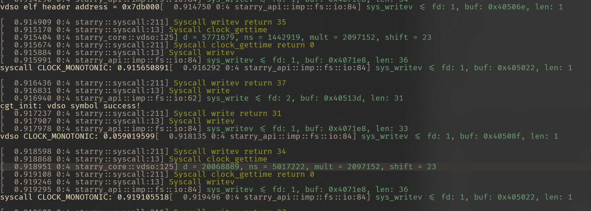

# 2025-7-22

## 记录

- 尝试解决之前提到的时间精度问题，已找到解决方案，还存在一些 bug。

### 问题

- linux 中获得的 cycle 值大于starry中的值

### 运行结果

vdso 的输出只是 cycle - last_cycle 的值，没有 basetime 中的数据。



### 代码

```diff
diff --git a/api/src/imp/time.rs b/api/src/imp/time.rs
index 6311f8b..5a9d9b7 100644
--- a/api/src/imp/time.rs
+++ b/api/src/imp/time.rs
@@ -3,7 +3,7 @@ use axhal::time::{monotonic_time, monotonic_time_nanos, nanos_to_ticks, wall_tim
 use linux_raw_sys::general::{
     __kernel_clockid_t, CLOCK_MONOTONIC, CLOCK_REALTIME, timespec, timeval,
 };
-use starry_core::task::time_stat_output;
+use starry_core::{task::time_stat_output, vdso_info};
 
 use crate::{ptr::UserPtr, time::TimeValueLike};
 
@@ -11,6 +11,7 @@ pub fn sys_clock_gettime(
     clock_id: __kernel_clockid_t,
     ts: UserPtr<timespec>,
 ) -> LinuxResult<isize> {
+    vdso_info().lock().debug();
     let now = match clock_id as u32 {
         CLOCK_REALTIME => wall_time(),
         CLOCK_MONOTONIC => monotonic_time(),
diff --git a/apps/myapp/hello.c b/apps/myapp/hello.c
index 08975dc..774e3e0 100644
--- a/apps/myapp/hello.c
+++ b/apps/myapp/hello.c
@@ -5,7 +5,7 @@
 void test_sys() {
   struct timespec ts;
   int ret;
-  int clk_id = CLOCK_REALTIME; // 0
+  int clk_id = CLOCK_MONOTONIC; // 0
 
   asm volatile("movq $228, %%rax\n\t"   // SYS_clock_gettime
                "movq %[clk], %%rdi\n\t" // clock ID
diff --git a/core/src/vdso.rs b/core/src/vdso.rs
index 95b4942..86f0cb9 100644
--- a/core/src/vdso.rs
+++ b/core/src/vdso.rs
@@ -4,7 +4,13 @@ use alloc::boxed::Box;
 use axalloc::GlobalPage;
 use axerrno::{AxError, AxResult};
 use axhal::{
-    trap::{IRQ, register_trap_handler}, mem::{phys_to_virt, virt_to_phys}, paging::{MappingFlags, PageSize}, time::{current_ticks, monotonic_time, wall_time, TimeValue, TIMER_IRQ_NUM}
+    mem::{phys_to_virt, virt_to_phys},
+    paging::{MappingFlags, PageSize},
+    time::{
+        NANOS_PER_SEC, TIMER_IRQ_NUM, TimeValue, current_ticks, monotonic_time, ticks_to_nanos,
+        wall_time,
+    },
+    trap::{IRQ, register_trap_handler},
 };
 use axmm::AddrSpace;
 use axsync::spin::SpinNoIrq;
@@ -45,7 +51,6 @@ unsafe extern "C" {
     fn vdso_end();
 }
 
-
 #[register_trap_handler(IRQ)]
 fn update_vdso_with_irq(irq_num: usize) -> bool {
     if irq_num == TIMER_IRQ_NUM {
@@ -107,13 +112,26 @@ pub fn vdso_info() -> &'static SpinNoIrq<Vdso> {
     &VDSO
 }
 
-struct Vdso {
+pub struct Vdso {
     data: &'static mut VdsoData,
     vdso_data_paddr: PhysAddr,
     vdso_text_paddr: PhysAddr,
     frame: GlobalPage,
 }
 
+impl Vdso {
+    pub fn debug(&self) {
+        let d = current_ticks() - self.data.last_cycles;
+        debug!(
+            "d = {}, ns = {}, mult = {}, shift = {}",
+            d,
+            (d * (self.data.mult as u64) >> self.data.shift),
+            self.data.mult,
+            self.data.shift,
+        );
+    }
+}
+
 impl Default for Vdso {
     fn default() -> Self {
         let page_size: usize = PageSize::Size4K.into();
@@ -163,8 +181,9 @@ impl Vdso {
         self.data.seq = 1;
         self.data.last_cycles = current_ticks();
 
-        self.data.basetime[CLOCK_MONOTONIC as usize] = monotonic_time();
-        self.data.basetime[CLOCK_REALTIME as usize] = wall_time();
+        let shift = self.data.shift;
+        // self.data.basetime[CLOCK_MONOTONIC as usize].from_time_value(monotonic_time(), shift);
+        self.data.basetime[CLOCK_REALTIME as usize].from_time_value(wall_time(), shift);
 
         self.data.seq = 0;
         // debug!("update = {:#?}", self.data);
@@ -172,6 +191,19 @@ impl Vdso {
 }
 
 const VDSO_BASES: usize = 12;
+#[repr(C)]
+#[derive(Debug, Default)]
+struct VdsoTimeVal {
+    sec: u64,
+    nanos_info: u64,
+}
+
+impl VdsoTimeVal {
+    fn from_time_value(&mut self, tv: TimeValue, shift: u32) {
+        self.sec = tv.as_secs();
+        self.nanos_info = (tv.subsec_nanos() as u64) << shift;
+    }
+}
 
 #[repr(C)]
 #[derive(Default, Debug)]
@@ -183,7 +215,7 @@ struct VdsoData {
     mask: u64,
     mult: u32,
     shift: u32,
-    basetime: [TimeValue; VDSO_BASES],
+    basetime: [VdsoTimeVal; VDSO_BASES],
 
     tz_minuteswest: i32,
     tz_dsttime: i32,
@@ -194,5 +226,41 @@ struct VdsoData {
 impl VdsoData {
     fn init(&mut self) {
         self.clock_mode = 1;
+        self.last_cycles = current_ticks();
+
+        // clac shift mult
+        let from = axconfig::devices::TIMER_FREQUENCY as u64;
+        let to = NANOS_PER_SEC;
+        self.clocks_calc_mult_shift(from, to, 600);
+    }
+
+    fn clocks_calc_mult_shift(&mut self, from: u64, to: u64, maxsec: u32) {
+        let mut tmp: u64 = (from * maxsec as u64) >> 32;
+        let mut sftacc: u32 = 32;
+        debug!("tmp = {:#b}", tmp);
+        while tmp > 0 {
+            tmp >>= 1;
+            sftacc -= 1;
+        }
+
+        let mut sft: u32 = 32;
+        debug!("tmp = {}, sftacc = {}", tmp, sftacc);
+
+        while sft > 0 {
+            tmp = to << sft;
+            tmp += from / 2;
+
+            tmp /= from;
+
+            if (tmp >> sftacc) == 0 {
+                break;
+            }
+
+            sft -= 1;
+        }
+
+        self.mult = tmp as u32;
+        self.shift = sft;
+        debug!("mult = {}, shift = {}", self.mult, self.shift);
     }
 }

```


## 笔记

Linux 在获取当前时间时，会计算与上次更新的差值，来提升精确度。

```c
static __always_inline u64 vdso_calc_ns(const struct vdso_data *vd, u64 cycles, u64 base)
{
	u64 delta = cycles - vd->cycle_last;

	/*
	 * Negative motion and deltas which can cause multiplication
	 * overflow require special treatment. This check covers both as
	 * negative motion is guaranteed to be greater than @vd::max_cycles
	 * due to unsigned comparison.
	 *
	 * Due to the MSB/Sign-bit being used as invalid marker (see
	 * arch_vdso_cycles_ok() above), the effective mask is S64_MAX, but that
	 * case is also unlikely and will also take the unlikely path here.
	 */
	if (unlikely(delta > vd->max_cycles)) {
		/*
		 * Due to the above mentioned TSC wobbles, filter out
		 * negative motion.  Per the above masking, the effective
		 * sign bit is now bit 62.
		 */
		if (delta & (1ULL << 62))
			return base >> vd->shift;

		/* Handle multiplication overflow gracefully */
		return mul_u64_u32_add_u64_shr(delta & S64_MAX, vd->mult, base, vd->shift);
	}

	return ((delta * vd->mult) + base) >> vd->shift;
}
```

上次更新的值就是存放在 `vdso_data` 中的 `basetime`, 加上这个差值就能弥补时钟中断间隔带来的精度损耗。

当前值是从 `stc` 寄存器中获取的，因此需要转化位 ns.

公式位：

$$
ns = \frac{tricks * nanos\_per\_sec}{timer\_frequency}
$$

其中 `tricks` 是 `stc` 的值， `nanos_per_sec` 是每秒有多少纳秒（`1e9`）, `timer_frequency` 时钟频率（starry中为`4e9`）


Linux 使用乘法和移位运算代替了除法：

$$
ns = tricks * mult >> shift
$$

```c
// from = timer_frequency
// to = nanos_pre_sec
void
clocks_calc_mult_shift(u32 *mult, u32 *shift, u32 from, u32 to, u32 maxsec)
{
	u64 tmp;
	u32 sft, sftacc= 32;

	/*
	 * Calculate the shift factor which is limiting the conversion
	 * range:
	 */
	tmp = ((u64)maxsec * from) >> 32;
	while (tmp) {
		tmp >>=1;
		sftacc--;
	}

	/*
	 * Find the conversion shift/mult pair which has the best
	 * accuracy and fits the maxsec conversion range:
	 */
	for (sft = 32; sft > 0; sft--) {
		tmp = (u64) to << sft;
		tmp += from / 2;
		do_div(tmp, from);
		if ((tmp >> sftacc) == 0)
			break;
	}
	*mult = tmp;
	*shift = sft;
}
```


## 参考
https://arthurchiao.art/blog/linux-clock-source-tsc-zh/

https://kernel.meizu.com/2023/12/13/Full-stack-resolution-of-the-Linux-time-subsystem/


