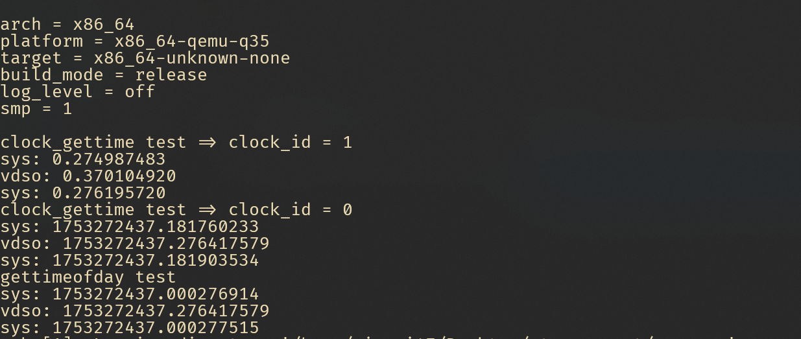
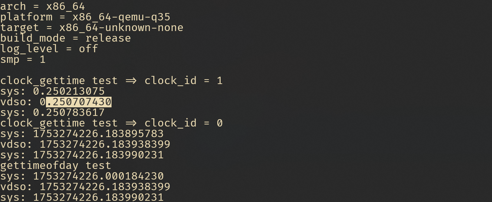

# 2025-7-22

## 记录

- 重构代码

- tsc 的问题仍然存在，但是 `clock_mode = pvclock` 时，是正确的，猜测可能是因为 qemu 的配置(可能是因为在虚拟机中?， wsl2?)。

### TODO

- 锁

- 支持更多架构(aarch64, loongarch64)

- `get_cpu`

### 运行结果

设置 `VDSO_CLOCKMODE_TSC = 1` 时的输出



设置 `VDSO_CLOCKMODE_PVCLOCK = 2` 时的输出



### 代码

```diff
From ce84d2e1c50c524660552390510ef320230b0f14 Mon Sep 17 00:00:00 2001
From: mingzi <mingzi0147@gmail.com>
Date: Wed, 23 Jul 2025 20:46:19 +0800
Subject: [PATCH] [vdso]: Refactor the vDSO code to add a new arch-specific
 module.

---
 Cargo.lock                        |  29 +++++
 Cargo.toml                        |   2 +-
 api/src/imp/time.rs               |   3 +-
 apps/myapp/Makefile               |   6 +-
 apps/myapp/hello.c                |  81 +++++++-----
 core/Cargo.toml                   |   1 +
 core/src/lib.rs                   |   2 +
 core/src/mm.rs                    |  10 +-
 core/src/vdso.rs                  | 200 +++++++++++-------------------
 core/src/vdso_arch/aarch64.rs     |  22 ++++
 core/src/vdso_arch/loongarch64.rs |  21 ++++
 core/src/vdso_arch/mod.rs         |  32 +++++
 core/src/vdso_arch/riscv.rs       |  21 ++++
 core/src/vdso_arch/x86_64.rs      |  20 +++
 14 files changed, 282 insertions(+), 168 deletions(-)
 create mode 100644 core/src/vdso_arch/aarch64.rs
 create mode 100644 core/src/vdso_arch/loongarch64.rs
 create mode 100644 core/src/vdso_arch/mod.rs
 create mode 100644 core/src/vdso_arch/riscv.rs
 create mode 100644 core/src/vdso_arch/x86_64.rs

diff --git a/Cargo.lock b/Cargo.lock
index 6a97cdc..9e3844e 100644
--- a/Cargo.lock
+++ b/Cargo.lock
@@ -89,6 +89,15 @@ dependencies = [
  "tock-registers 0.8.1",
 ]
 
+[[package]]
+name = "arm_pl031"
+version = "0.2.1"
+source = "registry+https://github.com/rust-lang/crates.io-index"
+checksum = "13696b1c2b59992f4223e0ae5bb173c81c63039367ca90eee845346ad2a13421"
+dependencies = [
+ "chrono",
+]
+
 [[package]]
 name = "atomic-polyfill"
 version = "1.0.3"
@@ -292,6 +301,7 @@ dependencies = [
  "aarch64-cpu",
  "arm_gicv2",
  "arm_pl011",
+ "arm_pl031",
  "axalloc",
  "axconfig",
  "axlog",
@@ -313,12 +323,14 @@ dependencies = [
  "percpu",
  "raw-cpuid 11.5.0",
  "riscv 0.13.0",
+ "riscv_goldfish",
  "sbi-rt",
  "static_assertions",
  "tock-registers 0.9.0",
  "x2apic",
  "x86",
  "x86_64 0.15.2",
+ "x86_rtc",
 ]
 
 [[package]]
@@ -1131,6 +1143,12 @@ version = "0.2.0"
 source = "registry+https://github.com/rust-lang/crates.io-index"
 checksum = "8188909339ccc0c68cfb5a04648313f09621e8b87dc03095454f1a11f6c5d436"
 
+[[package]]
+name = "riscv_goldfish"
+version = "0.1.1"
+source = "registry+https://github.com/rust-lang/crates.io-index"
+checksum = "07aac72f95e774476db82916d79f2d303191310393830573c1ab5c821b21660a"
+
 [[package]]
 name = "rlsf"
 version = "0.2.1"
@@ -1298,6 +1316,7 @@ dependencies = [
  "axsignal",
  "axsync",
  "axtask",
+ "cfg-if",
  "crate_interface",
  "kernel-elf-parser",
  "linkme",
@@ -1612,6 +1631,16 @@ dependencies = [
  "volatile",
 ]
 
+[[package]]
+name = "x86_rtc"
+version = "0.1.1"
+source = "registry+https://github.com/rust-lang/crates.io-index"
+checksum = "d1a42420da20c01d82e5d42231570efa3b9e16a5515eaaf9ee4e964f49cc1313"
+dependencies = [
+ "cfg-if",
+ "x86_64 0.15.2",
+]
+
 [[package]]
 name = "xmas-elf"
 version = "0.9.1"
diff --git a/Cargo.toml b/Cargo.toml
index 57cff36..81aa773 100644
--- a/Cargo.toml
+++ b/Cargo.toml
@@ -24,7 +24,7 @@ axfeat = { git = "https://github.com/oscomp/arceos.git", features = [
 
 axconfig = { git = "https://github.com/oscomp/arceos.git" }
 axfs = { git = "https://github.com/oscomp/arceos.git" }
-axhal = { git = "https://github.com/oscomp/arceos.git", features = ["uspace"] }
+axhal = { git = "https://github.com/oscomp/arceos.git", features = ["uspace", "rtc"] }
 axlog = { git = "https://github.com/oscomp/arceos.git" }
 axmm = { git = "https://github.com/oscomp/arceos.git" }
 axnet = { git = "https://github.com/oscomp/arceos.git" }
diff --git a/api/src/imp/time.rs b/api/src/imp/time.rs
index 5a9d9b7..6311f8b 100644
--- a/api/src/imp/time.rs
+++ b/api/src/imp/time.rs
@@ -3,7 +3,7 @@ use axhal::time::{monotonic_time, monotonic_time_nanos, nanos_to_ticks, wall_tim
 use linux_raw_sys::general::{
     __kernel_clockid_t, CLOCK_MONOTONIC, CLOCK_REALTIME, timespec, timeval,
 };
-use starry_core::{task::time_stat_output, vdso_info};
+use starry_core::task::time_stat_output;
 
 use crate::{ptr::UserPtr, time::TimeValueLike};
 
@@ -11,7 +11,6 @@ pub fn sys_clock_gettime(
     clock_id: __kernel_clockid_t,
     ts: UserPtr<timespec>,
 ) -> LinuxResult<isize> {
-    vdso_info().lock().debug();
     let now = match clock_id as u32 {
         CLOCK_REALTIME => wall_time(),
         CLOCK_MONOTONIC => monotonic_time(),
diff --git a/apps/myapp/Makefile b/apps/myapp/Makefile
index 7394446..38990c3 100644
--- a/apps/myapp/Makefile
+++ b/apps/myapp/Makefile
@@ -1,7 +1,5 @@
-# CC = $(ARCH)-linux-musl-gcc
-
-CC = ~/Downloads/musl-test/bin/x86_64-linux-musl-gcc
-CFLAGS = -static -g
+CC = $(ARCH)-linux-musl-gcc
+CFLAGS = -static
 
 TARGET_DIR = build/$(ARCH)
 TARGET = $(TARGET_DIR)/hello
diff --git a/apps/myapp/hello.c b/apps/myapp/hello.c
index 774e3e0..9d0c234 100644
--- a/apps/myapp/hello.c
+++ b/apps/myapp/hello.c
@@ -1,40 +1,59 @@
+#include <stdint.h>
 #include <stdio.h>
 #include <sys/auxv.h>
+#include <sys/syscall.h>
+#include <sys/time.h>
 #include <time.h>
+#include <unistd.h>
 
-void test_sys() {
-  struct timespec ts;
+#define PRINT(tag, ret, arg1, arg2)                                            \
+  do {                                                                         \
+    if ((ret) == 0) {                                                          \
+      printf("%s: %ld.%09ld\n", (tag), arg1, arg2);                            \
+    } else {                                                                   \
+      printf("%s failed, ret = %d\n", (tag), (int)(ret));                      \
+    }                                                                          \
+  } while (0)
+
+void test_clock_gettime(clockid_t clock_id) {
+  printf("clock_gettime test => clock_id = %d\n", clock_id);
+  int ret;
+
+  struct timespec ts1;
+  ret = syscall(SYS_clock_gettime, clock_id, &ts1);
+  PRINT("sys", ret, ts1.tv_sec, ts1.tv_nsec);
+
+  struct timespec ts2;
+  ret = clock_gettime(clock_id, &ts2);
+  PRINT("vdso", ret, ts2.tv_sec, ts2.tv_nsec);
+
+  struct timespec ts3;
+  ret = syscall(SYS_clock_gettime, clock_id, &ts3);
+  PRINT("sys", ret, ts3.tv_sec, ts3.tv_nsec);
+}
+
+void test_gettimeofday() {
+  printf("gettimeofday test\n");
   int ret;
-  int clk_id = CLOCK_MONOTONIC; // 0
-
-  asm volatile("movq $228, %%rax\n\t"   // SYS_clock_gettime
-               "movq %[clk], %%rdi\n\t" // clock ID
-               "movq %[tsp], %%rsi\n\t" // pointer to timespec
-               "syscall\n\t"
-               "movl %%eax, %[ret]\n\t" // store return value
-               : [ret] "=r"(ret)
-               : [clk] "r"((long)clk_id), [tsp] "r"(&ts)
-               : "rax", "rdi", "rsi", "rcx", "r11", "memory");
-
-  if (ret == 0) {
-    printf("syscall CLOCK_MONOTONIC: %ld.%09ld\n", ts.tv_sec, ts.tv_nsec);
-  } else {
-    printf("syscall clock_gettime failed, res = %d\n", ret);
-  }
+
+  struct timeval tv1;
+  ret = syscall(SYS_gettimeofday, &tv1, NULL);
+  PRINT("sys", ret, tv1.tv_sec, tv1.tv_usec);
+
+  struct timeval tv2;
+  ret = gettimeofday(&tv1, NULL);
+  PRINT("vdso", ret, tv2.tv_sec, tv2.tv_usec);
+  struct timeval tv3;
+  ret = syscall(SYS_gettimeofday, &tv2, NULL);
+  PRINT("sys", ret, tv3.tv_sec, tv3.tv_usec);
 }
 
 int main() {
-  unsigned long addr = getauxval(AT_SYSINFO_EHDR);
-  printf("vdso elf header address = %#lx\n", addr);
-
-  test_sys();
-  struct timespec ts;
-  int res = clock_gettime(CLOCK_MONOTONIC, &ts);
-
-  if (res == 0) {
-    printf("vdso CLOCK_MONOTONIC: %ld.%09ld\n", ts.tv_sec, ts.tv_nsec);
-  } else {
-    printf("vdso clock_gettime failed, res = %d\n", res);
-  }
-  test_sys();
+  // unsigned long addr = getauxval(AT_SYSINFO_EHDR);
+  // printf("vdso elf header address = %#lx\n", addr);
+  //
+  test_clock_gettime(CLOCK_MONOTONIC);
+  test_clock_gettime(CLOCK_REALTIME);
+
+  test_gettimeofday();
 }
diff --git a/core/Cargo.toml b/core/Cargo.toml
index 0b41d32..877077c 100644
--- a/core/Cargo.toml
+++ b/core/Cargo.toml
@@ -24,6 +24,7 @@ axerrno.workspace = true
 linkme.workspace = true
 memory_addr.workspace = true
 spin.workspace = true
+cfg-if.workspace = true
 
 crate_interface = "0.1"
 kernel-elf-parser = "0.3"
diff --git a/core/src/lib.rs b/core/src/lib.rs
index 126a265..2fd6eea 100644
--- a/core/src/lib.rs
+++ b/core/src/lib.rs
@@ -15,3 +15,5 @@ mod time;
 
 pub mod vdso;
 pub use vdso::*;
+
+pub mod vdso_arch;
diff --git a/core/src/mm.rs b/core/src/mm.rs
index 9c5ed8e..777fffb 100644
--- a/core/src/mm.rs
+++ b/core/src/mm.rs
@@ -9,7 +9,7 @@ use axhal::{
     paging::{MappingFlags, PageSize},
 };
 use axmm::{AddrSpace, kernel_aspace};
-use kernel_elf_parser::{app_stack_region, AuxvEntry, AuxvType, ELFParser};
+use kernel_elf_parser::{AuxvEntry, AuxvType, ELFParser, app_stack_region};
 use memory_addr::{MemoryAddr, PAGE_SIZE_4K, VirtAddr};
 use xmas_elf::{ElfFile, program::SegmentData};
 
@@ -56,7 +56,7 @@ pub fn map_trampoline(aspace: &mut AddrSpace) -> AxResult {
 ///
 /// # Returns
 /// - The entry point of the user app.
-fn map_elf(uspace: &mut AddrSpace, elf: &ElfFile) -> AxResult<(VirtAddr, [AuxvEntry; 17])> {
+fn map_elf(uspace: &mut AddrSpace, elf: &ElfFile) -> AxResult<(VirtAddr, Vec<AuxvEntry>)> {
     let uspace_base = uspace.base().as_usize();
     let elf_parser = ELFParser::new(
         elf,
@@ -94,9 +94,9 @@ fn map_elf(uspace: &mut AddrSpace, elf: &ElfFile) -> AxResult<(VirtAddr, [AuxvEn
     }
 
     let vdso_elf_addr = mapping_vdso_uspace(uspace)?;
-    let mut auxv_vector: [AuxvEntry; 17] = [AuxvEntry::new(AuxvType::NULL, 0); 17];
-    auxv_vector[..16].copy_from_slice(&elf_parser.auxv_vector(PAGE_SIZE_4K));
-    auxv_vector[16] = AuxvEntry::new(AuxvType::SYSINFO_EHDR, vdso_elf_addr);
+
+    let mut auxv_vector = elf_parser.auxv_vector(PAGE_SIZE_4K).to_vec();
+    auxv_vector.push(AuxvEntry::new(AuxvType::SYSINFO_EHDR, vdso_elf_addr));
 
     Ok((elf_parser.entry().into(), auxv_vector))
 }
diff --git a/core/src/vdso.rs b/core/src/vdso.rs
index 86f0cb9..a923bfb 100644
--- a/core/src/vdso.rs
+++ b/core/src/vdso.rs
@@ -1,145 +1,52 @@
-use core::{alloc::GlobalAlloc, arch::global_asm, slice};
-
-use alloc::boxed::Box;
 use axalloc::GlobalPage;
 use axerrno::{AxError, AxResult};
 use axhal::{
     mem::{phys_to_virt, virt_to_phys},
     paging::{MappingFlags, PageSize},
-    time::{
-        NANOS_PER_SEC, TIMER_IRQ_NUM, TimeValue, current_ticks, monotonic_time, ticks_to_nanos,
-        wall_time,
-    },
-    trap::{IRQ, register_trap_handler},
+    time::{current_ticks, epochoffset_nanos, monotonic_time, wall_time, TimeValue, NANOS_PER_SEC, TIMER_IRQ_NUM},
+    trap::{register_trap_handler, IRQ},
 };
 use axmm::AddrSpace;
 use axsync::spin::SpinNoIrq;
-use linux_raw_sys::general::{CLOCK_MONOTONIC, CLOCK_REALTIME};
+use linux_raw_sys::general::{CLOCK_MONOTONIC, CLOCK_REALTIME, CLOCK_TAI};
 use memory_addr::{PhysAddr, VirtAddrRange, va};
 use spin::Lazy;
 
-// global_asm!(
-//     "
-// 	.globl vdso_start, vdso_end
-// 	.section .data
-//     .balign 4096
-// vdso_start:
-// 	.incbin \"apps/vdso/riscv64/vdso.so\"
-// 	.balign 4096
-// vdso_end:
-//
-// 	.previous
-//     "
-// );
-
-global_asm!(
-    "
-	.globl vdso_start, vdso_end
-	.section .data
-    .balign 4096
-vdso_start:
-	.incbin \".vscode/vdso/x86_64/vdso.so\"
-	.balign 4096
-vdso_end:
-
-	.previous
-    "
-);
-
-unsafe extern "C" {
-    fn vdso_start();
-    fn vdso_end();
-}
-
-#[register_trap_handler(IRQ)]
-fn update_vdso_with_irq(irq_num: usize) -> bool {
-    if irq_num == TIMER_IRQ_NUM {
-        vdso_info().lock().update();
-    }
-
-    true
-}
-
-fn vdso_text_start() -> usize {
-    vdso_start as usize
-}
-
-fn vdso_text_size() -> usize {
-    vdso_end as usize - vdso_start as usize
-}
-
-fn vdso_data_size() -> usize {
-    0x4000
-}
-
-pub fn mapping_vdso_uspace(aspace: &mut AddrSpace) -> AxResult<usize> {
-    let data_start = VDSO.lock().vdso_data_paddr.as_usize();
-    let text_start = VDSO.lock().vdso_text_paddr.as_usize();
-
-    let start_vaddr = aspace
-        .find_free_area(
-            va!(data_start),
-            vdso_data_size() + vdso_text_size(),
-            VirtAddrRange::new(va!(data_start), aspace.end()),
-            PageSize::Size4K,
-        )
-        .ok_or(AxError::NoMemory)?;
-
-    debug!("mapping vdso : start_vaddr = {:#?}", start_vaddr);
-
-    aspace.map_linear(
-        start_vaddr,
-        data_start.into(),
-        vdso_data_size(),
-        MappingFlags::READ | MappingFlags::USER,
-        PageSize::Size4K,
-    )?;
+use crate::vdso_arch::{VDSO_DATA_SIZE, VDSO_VVAR_OFFSET, vdso_text_size, vdso_text_start};
 
-    aspace.map_linear(
-        start_vaddr + vdso_data_size(),
-        text_start.into(),
-        vdso_text_size(),
-        MappingFlags::READ | MappingFlags::EXECUTE | MappingFlags::USER,
-        PageSize::Size4K,
-    )?;
+const VDSO_BASES: usize = CLOCK_TAI as usize + 1;
+const DEFAULT_CLOCK_MODE: VdsoClockMode = VdsoClockMode::Pvclock;
 
-    Ok((start_vaddr + vdso_data_size()).into())
+#[derive(Debug, Copy, Clone)]
+enum VdsoClockMode {
+    None = 0,
+    Tsc = 1,
+    Pvclock = 2,
+    Timens = i32::MAX as isize,
 }
 
 static VDSO: Lazy<SpinNoIrq<Vdso>> = Lazy::new(|| SpinNoIrq::new(Vdso::default()));
 
+///
 pub fn vdso_info() -> &'static SpinNoIrq<Vdso> {
     &VDSO
 }
 
-pub struct Vdso {
+struct Vdso {
     data: &'static mut VdsoData,
-    vdso_data_paddr: PhysAddr,
-    vdso_text_paddr: PhysAddr,
+    data_start: PhysAddr,
+    test_start: PhysAddr,
     frame: GlobalPage,
 }
 
-impl Vdso {
-    pub fn debug(&self) {
-        let d = current_ticks() - self.data.last_cycles;
-        debug!(
-            "d = {}, ns = {}, mult = {}, shift = {}",
-            d,
-            (d * (self.data.mult as u64) >> self.data.shift),
-            self.data.mult,
-            self.data.shift,
-        );
-    }
-}
-
 impl Default for Vdso {
     fn default() -> Self {
         let page_size: usize = PageSize::Size4K.into();
-        let num_pages = (vdso_data_size() + vdso_text_size() + page_size) / page_size;
+        let num_pages = (VDSO_DATA_SIZE + vdso_text_size() + page_size) / page_size;
         let frame = GlobalPage::alloc_contiguous(num_pages, page_size).expect("Alloc Vdso failed!");
 
         let vdso_data_paddr = frame.start_paddr(virt_to_phys);
-        let vdso_text_paddr = vdso_data_paddr + vdso_data_size();
+        let vdso_text_paddr = vdso_data_paddr + VDSO_DATA_SIZE;
 
         debug!(
             "vdso = {:#x}, vdso phy = {:#?}",
@@ -153,7 +60,7 @@ impl Default for Vdso {
         );
 
         // init vdso data
-        let data_ptr: usize = phys_to_virt(vdso_data_paddr + 0x80).into();
+        let data_ptr: usize = phys_to_virt(vdso_data_paddr + VDSO_VVAR_OFFSET).into();
         let data = unsafe { &mut *(data_ptr as *mut VdsoData) };
         data.init();
 
@@ -168,8 +75,8 @@ impl Default for Vdso {
 
         Self {
             data,
-            vdso_data_paddr,
-            vdso_text_paddr,
+            data_start: vdso_data_paddr,
+            test_start: vdso_text_paddr,
             frame,
         }
     }
@@ -182,15 +89,14 @@ impl Vdso {
         self.data.last_cycles = current_ticks();
 
         let shift = self.data.shift;
-        // self.data.basetime[CLOCK_MONOTONIC as usize].from_time_value(monotonic_time(), shift);
+        self.data.basetime[CLOCK_MONOTONIC as usize].from_time_value(monotonic_time(), shift);
         self.data.basetime[CLOCK_REALTIME as usize].from_time_value(wall_time(), shift);
+        debug!("epochoffset_nanos = {}",  epochoffset_nanos());
 
         self.data.seq = 0;
-        // debug!("update = {:#?}", self.data);
     }
 }
 
-const VDSO_BASES: usize = 12;
 #[repr(C)]
 #[derive(Debug, Default)]
 struct VdsoTimeVal {
@@ -225,27 +131,26 @@ struct VdsoData {
 
 impl VdsoData {
     fn init(&mut self) {
-        self.clock_mode = 1;
+        self.clock_mode = DEFAULT_CLOCK_MODE as i32;
         self.last_cycles = current_ticks();
 
         // clac shift mult
-        let from = axconfig::devices::TIMER_FREQUENCY as u64;
-        let to = NANOS_PER_SEC;
-        self.clocks_calc_mult_shift(from, to, 600);
+        self.clocks_calc_mult_shift(
+            axconfig::devices::TIMER_FREQUENCY as u64,
+            NANOS_PER_SEC,
+            600,
+        );
     }
 
     fn clocks_calc_mult_shift(&mut self, from: u64, to: u64, maxsec: u32) {
         let mut tmp: u64 = (from * maxsec as u64) >> 32;
         let mut sftacc: u32 = 32;
-        debug!("tmp = {:#b}", tmp);
         while tmp > 0 {
             tmp >>= 1;
             sftacc -= 1;
         }
 
         let mut sft: u32 = 32;
-        debug!("tmp = {}, sftacc = {}", tmp, sftacc);
-
         while sft > 0 {
             tmp = to << sft;
             tmp += from / 2;
@@ -261,6 +166,51 @@ impl VdsoData {
 
         self.mult = tmp as u32;
         self.shift = sft;
-        debug!("mult = {}, shift = {}", self.mult, self.shift);
     }
 }
+
+
+#[register_trap_handler(IRQ)]
+fn update_vdso_with_irq(irq_num: usize) -> bool {
+    if irq_num == TIMER_IRQ_NUM {
+        vdso_info().lock().update();
+    }
+
+    true
+}
+
+///
+pub fn mapping_vdso_uspace(aspace: &mut AddrSpace) -> AxResult<usize> {
+    let data_start = VDSO.lock().data_start.as_usize();
+    let text_start = VDSO.lock().test_start.as_usize();
+
+    let start_vaddr = aspace
+        .find_free_area(
+            va!(data_start),
+            VDSO_DATA_SIZE + vdso_text_size(),
+            VirtAddrRange::new(va!(data_start), aspace.end()),
+            PageSize::Size4K,
+        )
+        .ok_or(AxError::NoMemory)?;
+
+    debug!("mapping vdso : start_vaddr = {:#?}", start_vaddr);
+
+    aspace.map_linear(
+        start_vaddr,
+        data_start.into(),
+        VDSO_DATA_SIZE,
+        MappingFlags::READ | MappingFlags::USER,
+        PageSize::Size4K,
+    )?;
+
+    aspace.map_linear(
+        start_vaddr + VDSO_DATA_SIZE,
+        text_start.into(),
+        vdso_text_size(),
+        MappingFlags::READ | MappingFlags::EXECUTE | MappingFlags::USER,
+        PageSize::Size4K,
+    )?;
+
+    // debug!("vdso_data = ")
+    Ok((start_vaddr + VDSO_DATA_SIZE).into())
+}
diff --git a/core/src/vdso_arch/aarch64.rs b/core/src/vdso_arch/aarch64.rs
new file mode 100644
index 0000000..f7ab521
--- /dev/null
+++ b/core/src/vdso_arch/aarch64.rs
@@ -0,0 +1,22 @@
+use core::arch::global_asm;
+
+global_asm!(
+    "
+	.globl vdso_start, vdso_end
+	.section .data
+    .balign 4096
+vdso_start:
+	.incbin \".vscode/vdso/riscv64/vdso.so\"
+	.balign 4096
+vdso_end:
+
+	.previous
+    "
+);
+
+
+///
+pub const VDSO_DATA_SIZE: usize = 0x2000;
+///
+pub const VDSO_VVAR_OFFSET: usize = 0x0;
+
diff --git a/core/src/vdso_arch/loongarch64.rs b/core/src/vdso_arch/loongarch64.rs
new file mode 100644
index 0000000..6dbe8c7
--- /dev/null
+++ b/core/src/vdso_arch/loongarch64.rs
@@ -0,0 +1,21 @@
+use core::arch::global_asm;
+
+global_asm!(
+    "
+	.globl vdso_start, vdso_end
+	.section .data
+    .balign 4096
+vdso_start:
+	.incbin \".vscode/vdso/riscv64/vdso.so\"
+	.balign 4096
+vdso_end:
+
+	.previous
+    "
+);
+
+
+///
+pub const VDSO_DATA_SIZE: usize = 0x2000;
+///
+pub const VDSO_VVAR_OFFSET: usize = 0x0;
diff --git a/core/src/vdso_arch/mod.rs b/core/src/vdso_arch/mod.rs
new file mode 100644
index 0000000..8f0ea8d
--- /dev/null
+++ b/core/src/vdso_arch/mod.rs
@@ -0,0 +1,32 @@
+//!
+//!
+cfg_if::cfg_if! {
+    if #[cfg(target_arch = "x86_64")] {
+        mod x86_64;
+        pub use self::x86_64::*;
+    } else if #[cfg(any(target_arch = "riscv32", target_arch = "riscv64"))] {
+        mod riscv;
+        pub use self::riscv::*;
+    } else if #[cfg(target_arch = "aarch64")]{
+        mod aarch64;
+        pub use self::aarch64::*;
+    } else if #[cfg(target_arch = "loongarch64")] {
+        mod loongarch64;
+        pub use self::loongarch64::*;
+    } else {
+        compile_error!("Unsupported architecture");
+    }
+}
+
+unsafe extern "C" {
+    fn vdso_start();
+    fn vdso_end();
+}
+
+pub fn vdso_text_start() -> usize {
+    vdso_start as usize
+}
+
+pub fn vdso_text_size() -> usize {
+    vdso_end as usize - vdso_start as usize
+}
diff --git a/core/src/vdso_arch/riscv.rs b/core/src/vdso_arch/riscv.rs
new file mode 100644
index 0000000..6dbe8c7
--- /dev/null
+++ b/core/src/vdso_arch/riscv.rs
@@ -0,0 +1,21 @@
+use core::arch::global_asm;
+
+global_asm!(
+    "
+	.globl vdso_start, vdso_end
+	.section .data
+    .balign 4096
+vdso_start:
+	.incbin \".vscode/vdso/riscv64/vdso.so\"
+	.balign 4096
+vdso_end:
+
+	.previous
+    "
+);
+
+
+///
+pub const VDSO_DATA_SIZE: usize = 0x2000;
+///
+pub const VDSO_VVAR_OFFSET: usize = 0x0;
diff --git a/core/src/vdso_arch/x86_64.rs b/core/src/vdso_arch/x86_64.rs
new file mode 100644
index 0000000..7faa2b0
--- /dev/null
+++ b/core/src/vdso_arch/x86_64.rs
@@ -0,0 +1,20 @@
+use core::arch::global_asm;
+
+global_asm!(
+    "
+	.globl vdso_start, vdso_end
+	.section .data
+    .balign 4096
+vdso_start:
+	.incbin \".vscode/vdso/x86_64/vdso.so\"
+	.balign 4096
+vdso_end:
+
+	.previous
+    "
+);
+
+pub const VDSO_DATA_SIZE: usize = 0x4000;
+pub const VDSO_VVAR_OFFSET: usize = 0x80;
+
+
-- 
2.50.1
```